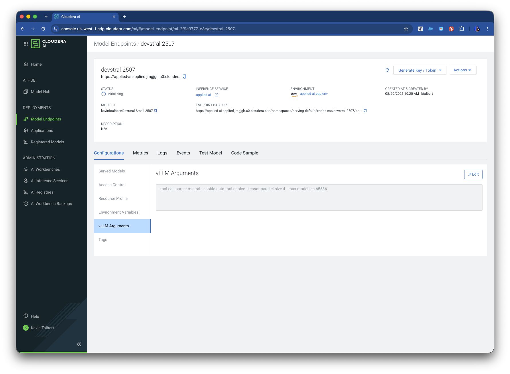
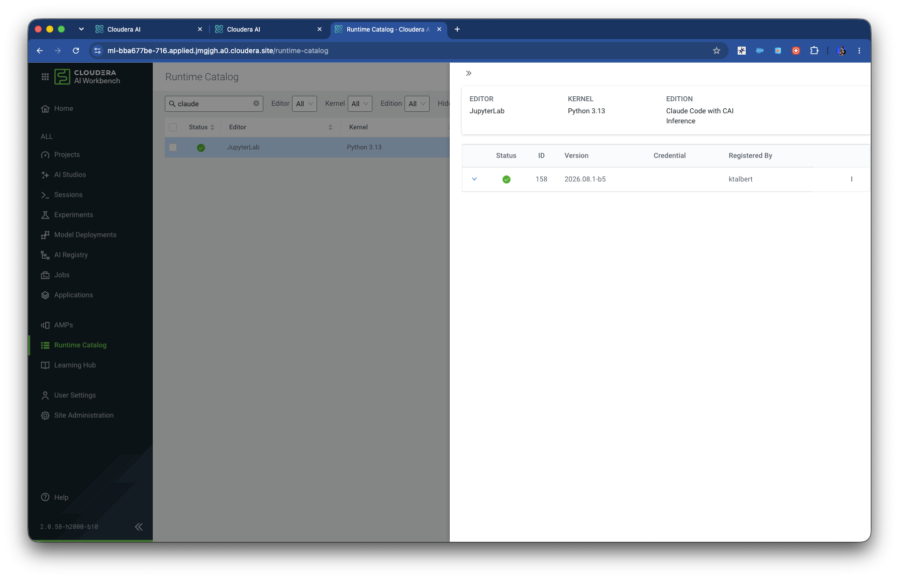
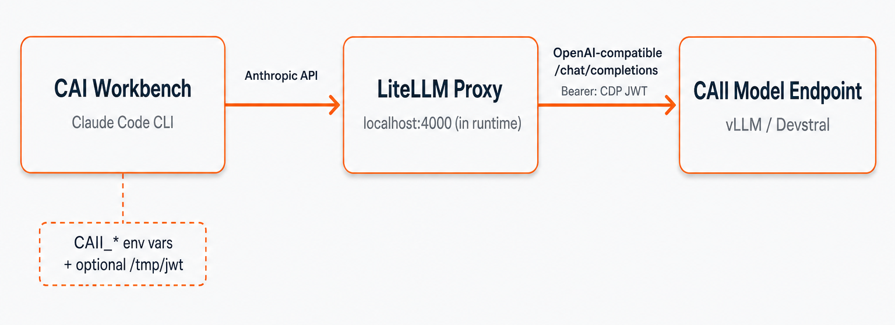

# Cloudera Blueprint: Claude Code with Cloudera AI Inference

> Run [Claude Code](https://code.claude.com/docs/en/quickstart) in Cloudera AI Workbench against [Devstral Small](https://huggingface.co/kevinbtalbert/Devstral-Small-2507) (or any model) on [Cloudera AI Inference (CAII)](https://docs.cloudera.com/machine-learning/cloud/ai-inference/topics/ml-caii-use-caii.html).

## Table of Contents

- [Overview](#overview)
- [Use Case](#use-case)
- [Key Features](#key-features)
- [Quickstart](#quickstart)
- [Recommended model](#recommended-model)
- [Architecture](#architecture)
- [Repository Structure](#repository-structure)
- [Prerequisites](#prerequisites)
- [Hardware Requirements](#hardware-requirements)
- [Troubleshooting](#troubleshooting)
- [Documentation](#documentation)
- [Optional: local install (laptop)](#optional-local-install-laptop)

## Overview

This blueprint connects **Claude Code**—Anthropic's terminal coding agent—to **your CAI Inference model endpoint**. A custom **workbench runtime image** preinstalls Claude Code and a local **LiteLLM proxy** that translates Anthropic's API to CAII's OpenAI-compatible API. Configuration comes from three **project environment variables** (`CAII_*`); inference stays on CAII (HF + vLLM or NIM). No model is hosted inside the workbench pod.

```
claude  →  LiteLLM (localhost:4000)  →  CAII endpoint (Devstral / vLLM)
```

## Use Case

**Problem:** Teams want **Claude Code's agentic workflow** (shell, edits, search) on **models they operate inside Cloudera**, with CDP authentication and existing CAII deployments—without routing traffic through Anthropic's cloud API.

**Outcome:** Deploy **Devstral** on CAII, register this runtime, set three env vars, run **`claude-sync-config`** and **`claude`** in a workbench terminal.

## Key Features

- **Custom CAI runtime** with Claude Code, LiteLLM, and agent-friendly tooling preinstalled
- **Pre-built image** supported—no Docker build required for most users
- **Config from env** (`CAII_*`) + `claude-sync-config`; JWT not written to disk
- **LiteLLM proxy** bridges Anthropic API → OpenAI-compatible CAII route
- **Dynamic JWT** from `/tmp/jwt` when `CAII_API_TOKEN` is unset (workbench default)
- **Optional local path** via [`Claude-CLI-with-CAI-Inference`](https://github.com/kevinbtalbert/Claude-CLI-with-CAI-Inference) on Mac/Linux

## Quickstart

### 1. Deploy CAI Inference model endpoint

Create a Hugging Face + vLLM endpoint using the [recommended model](#recommended-model) below.

In the Cloudera console:

1. **AI Inference → Model Endpoints → Create Endpoint**
2. Source: **Hugging Face** → `kevinbtalbert/Devstral-Small-2507`
3. Engine: **vLLM**
4. Under **Configurations → vLLM Arguments**, paste the [validated vLLM arguments](#recommended-model) for Devstral (tool calling + 2-GPU tensor parallel)

5. Deploy and wait for the endpoint to reach **Ready**
6. Copy the **Code Sample** base URL (include `/openai/v1` for vLLM)
7. Note the model id from **Test Model** or `GET …/models` (e.g. `kevinbtalbert/Devstral-Small-2507`)

### 2. Register the workbench runtime

**Option A (recommended):** Use the **pre-built runtime image** — no Docker build required. In **Admin → Runtime Catalog → Add Runtime**, paste:

```text
docker.io/kevintalbert/claudeworkbench:latest
```



When registered, the runtime shows **Edition: Claude Code + CAI Inference** and **Runtime Image: `docker.io/kevintalbert/claudeworkbench:latest`** with a green status checkmark.

Then create a project with that runtime and start a session. **No GPU required on the workbench pod**—inference runs on CAII.

**Option B:** Build and register from this repo:

```bash
docker build --pull --rm -f Dockerfile -t <your-registry>/claudeworkbench:1.0.0 .
# push to your registry, then Add Runtime in the catalog
```

The Docker build installs pinned LiteLLM/FastAPI versions from `requirements-litellm.txt` and runs `scripts/verify-litellm-install.sh` — the build fails if the proxy cannot import or start.

Create a project with that runtime and start a session.

### 3. Set environment variables

**Project → Settings → Advanced → Environment Variables** → **Submit**, then **restart the session** (stop/start workbench or start a new session).

After the session is back up, open a terminal and run **`claude-sync-config`** once to validate env, start LiteLLM, and write Claude settings (or run it again anytime you change env vars).

| Name | Value |
|------|--------|
| `CAII_OPENAI_BASE_URL` | From endpoint **Code Sample** — include `/openai/v1` for vLLM (e.g. `…/endpoints/devstral-small-2507/openai/v1`) |
| `CAII_API_TOKEN` | **Generate JWT Token** on the endpoint — **optional** if the workbench provides `/tmp/jwt` (runtime reads `access_token` from that file when this var is unset) |
| `CAII_MODEL` | Model id from **Test Model** or `GET …/models` (e.g. `kevinbtalbert/Devstral-Small-2507`) |

Use **`CAII_MODEL`**, not `CAI_MODEL_NAME` (`CAI_MODEL_NAME` is for the optional local install only).

Optional:

| Name | Default | Description |
|------|---------|-------------|
| `CAII_LITELLM_PORT` | `4000` | Local LiteLLM proxy port |
| `CAII_MAX_OUTPUT_TOKENS` | `8192` | Cap Claude Code output tokens to fit Devstral's 65536 context window |
| `CAII_MAX_INPUT_TOKENS` | `57344` | Advertised input limit to LiteLLM (65536 − output cap) |
| `LITELLM_USE_CHAT_COMPLETIONS_URL_FOR_ANTHROPIC_MESSAGES` | `true` | Required for most vLLM endpoints |

### 4. Sync and run Claude Code

In a JupyterLab terminal:

```bash
claude-sync-config
claude
```

One-shot prompt:

```bash
claude -p "explain this repo"
```

Helper commands:

| Command | Description |
|---------|-------------|
| `claude-sync-config` | Validate env, start/restart LiteLLM, write Claude settings |
| `claude` | Sync config then launch Claude Code |
| `claude-status` | Show env + proxy health |
| `claude-stop-proxy` | Stop background LiteLLM |
| `claude-logs` | Tail LiteLLM log |

## Recommended model

Use **[Devstral-Small-2507](https://huggingface.co/kevinbtalbert/Devstral-Small-2507)** on CAII **1.13.x** (text + tool calling; validated on HF + vLLM).

Devstral is Mistral's agentic coding model (24B params, 128k context, Mistral tool-calling format). It excels at codebase exploration, multi-file edits, and tool use—making it a strong backend for Claude Code's agent loop.



After the endpoint is **Running**, open **Configurations → vLLM Arguments** and paste:

```text
--tool-call-parser mistral --enable-auto-tool-choice --tensor-parallel-size 2 --max-model-len 65536
```

| Flag | Purpose |
|------|---------|
| `--tool-call-parser mistral` | Parse Devstral's Mistral-format tool calls (required for Claude Code's agent tools) |
| `--enable-auto-tool-choice` | Let vLLM emit tool calls when the model requests them |
| `--tensor-parallel-size 2` | Spread the 24B model across **2 GPUs** on the inference node |
| `--max-model-len 65536` | Context window cap (64k tokens; balances memory on a 2-GPU profile) |

Set **`CAII_MODEL`** to the endpoint's model id (shown on the endpoint page): `kevinbtalbert/Devstral-Small-2507`.

Allowed vLLM flags in the UI: [CAII supported vLLM arguments](https://docs.cloudera.com/machine-learning/cloud/release-notes/topics/ml-caii-supported-vllm-command-line-arguments.html).

## Architecture



| Component | Role |
|-----------|------|
| **Cloudera AI Inference** | Serves Devstral (HF import + vLLM in this blueprint) |
| **Custom runtime image** | JupyterLab + Claude Code + LiteLLM; `scripts/cai-runtime-startup.sh` |
| **LiteLLM** | Translates Anthropic API → OpenAI-compatible CAII API |
| **Claude Code** | Agent CLI (`claude`) — tools, bash, edits |
| **CDP JWT** | Auth to CAII endpoint (`CAII_API_TOKEN` or `/tmp/jwt`) |

## Repository Structure

| Path | Description |
| --- | --- |
| `assets/` | Screenshots for README and demos |
| `scripts/cai-runtime-startup.sh` | Runtime profile hook: `claude`, `claude-sync-config`, helpers |
| `scripts/lib/cai-common.sh` | LiteLLM proxy + CAII env helpers |
| `requirements-litellm.txt` | Pinned LiteLLM + FastAPI deps (verified at image build) |
| `scripts/verify-litellm-install.sh` | Build-time smoke test for the LiteLLM proxy |
| `Dockerfile` | Workbench runtime image definition |
| `METADATA.yaml` | Blueprint catalog metadata |

## Prerequisites

- Cloudera AI with **AI Inference** and **Workbench** (runtime catalog access for admins)
- A **running CAII endpoint** and permission to **Generate JWT Token**
- For custom image build: `docker`, registry push access

## Hardware Requirements

Sizing is for the **CAII model** (not the workbench runtime).

| Deployment | Guidance |
| --- | --- |
| **Devstral-Small-2507 (demo)** | **2 GPUs** for `--tensor-parallel-size 2` (e.g. **g6e.12xlarge**); `--max-model-len 65536` as above |
| **Workbench runtime** | Standard session resources (e.g. 2 vCPU / 4 GB RAM); **no GPU** on the workbench pod |

## Troubleshooting

| Issue | Fix |
|-------|-----|
| Banner: "Set CAII_* …" | **`CAII_OPENAI_BASE_URL`** + **`CAII_MODEL`** set? Token via **`CAII_API_TOKEN`** or readable **`/tmp/jwt`**? **New session** after Submit? |
| `claude-sync-config` fails | Same as above; check `curl -H "Authorization: Bearer $CAII_API_TOKEN" "$CAII_OPENAI_BASE_URL/models"` |
| `401 Unauthorized` | New JWT in `CAII_API_TOKEN` |
| Model error / 404 on `/responses` in `litellm.log` | vLLM endpoints need chat completions. Ensure `LITELLM_USE_CHAT_COMPLETIONS_URL_FOR_ANTHROPIC_MESSAGES=true` (default in this runtime), then `claude-stop-proxy` and `claude-sync-config` |
| Chat works, tools don't | Devstral + vLLM tool flags on the endpoint (`--enable-auto-tool-choice --tool-call-parser mistral`) |
| Proxy won't start | `claude-logs` or `tail ~/.claude/cai-inference/litellm.log`. The runtime image pins LiteLLM/FastAPI in `requirements-litellm.txt` and verifies the proxy at **Docker build** time — rebuild and re-register the runtime if you are on an older image. |
| `ContextWindowExceededError` / `requested 64000 output tokens` in `litellm.log` | Claude Code Opus 4.6 requests up to 64k output tokens; Devstral is capped at **65536** total context (`--max-model-len 65536`). The runtime defaults to **`CAII_MAX_OUTPUT_TOKENS=8192`** and **`CLAUDE_CODE_DISABLE_1M_CONTEXT=1`**. Run `claude-stop-proxy`, `claude-sync-config`, then `claude` again. Increase only if your endpoint uses a larger `--max-model-len`. |

## Documentation

- [CAI Inference overview](https://docs.cloudera.com/machine-learning/cloud/ai-inference/topics/ml-caii-use-caii.html)
- [CAI Authentication](https://docs.cloudera.com/machine-learning/cloud/ai-inference/topics/ml-caii-authentication.html)
- [Claude Code quickstart](https://code.claude.com/docs/en/quickstart)
- [LiteLLM + Claude Code (non-Anthropic models)](https://docs.litellm.ai/docs/tutorials/claude_non_anthropic_models)
- [Supported vLLM CLI args (CAII)](https://docs.cloudera.com/machine-learning/cloud/release-notes/topics/ml-caii-supported-vllm-command-line-arguments.html)
- [Devstral-Small-2507 model card](https://huggingface.co/kevinbtalbert/Devstral-Small-2507)

---

## Optional: local install (laptop)

For Mac/Linux outside Workbench, use the companion repo with interactive install and `claude-cai`:

```bash
git clone https://github.com/kevinbtalbert/Claude-CLI-with-CAI-Inference.git
cd Claude-CLI-with-CAI-Inference
./scripts/install-cai-claude.sh
claude-cai
```

That path uses **`CAI_API_BASE`**, **`CAI_CDP_TOKEN`**, and **`CAI_MODEL_NAME`** (not `CAII_*`).

MIT © 2026 Cloudera, Inc.
